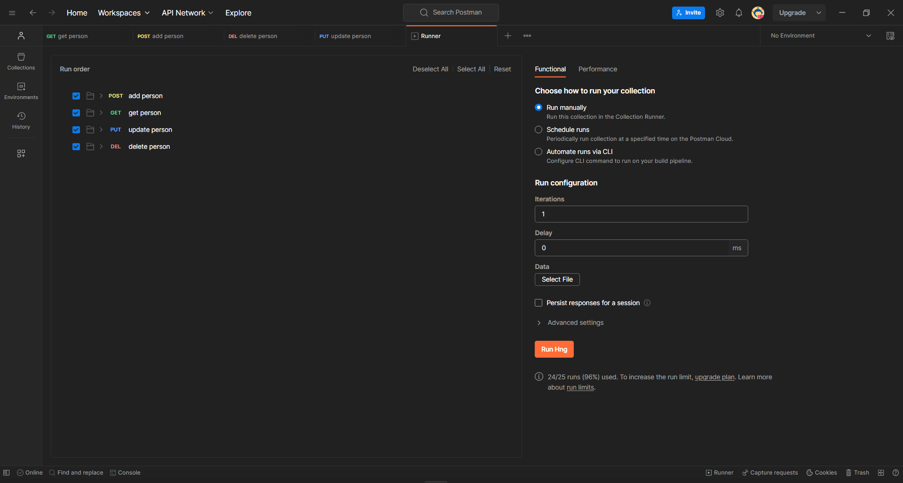
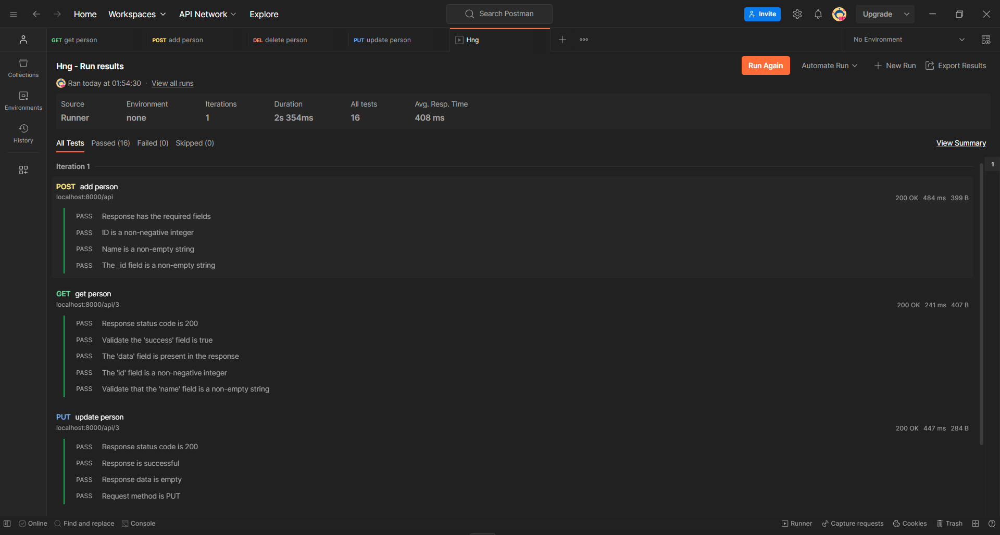

# REST API for Managing Persons

This is a simple REST API built with Nodejs, Express and MongoDB for managing persons. It allows you to perform CRUD (Create, Read, Update, Delete) operations on a "person" resource.

## Table of Contents
- [What to do before installing](#prerequisites)
- [Installation](#installation)
- [UML Diagram](#database-modeling)
- [Documentation](#documentation)
- [Testing](#testing)

## Prerequisites
Before getting started, ensure you have the following installed on your computer:
- Node.js and npm (Node Package Manager). You can use any package manager eg pnpm or yarn
- MongoDB (You can install it locally or use a cloud-based MongoDB service)

## Installation
Follow these steps to set up and run the project:

1. Clone the repository to your local machine:
   ```bash
   git clone https://github.com/CyberVerse2/hng-stage-2.git
   ```
   
2. Navigate to the project directory 
   ```bash
   cd api_hng_2
   ```
3. Run the following command to install dependencies:
   ```bash
   npm install
   ```
   
4. Create a .env file in the project root and configure your MongoDB connection:
   ```bash
   DB_URL=mongodb://localhost:27017/hng2
   PORT=3000
   ```

5. Run the following command to start the server:
   ```bash
     node index.js
   ```

Your Express server should now be running at http://localhost:8000.

## Database Modeling 
This UML diagram below represents the structure and relationships of the API's classes and models.


## Documentation 
 Here is the [postman](https://documenter.getpostman.com/view/27411559/2s9YC4WDPq) documentation for the API .

## Testing 
 The documentation include test to verify the API's functionality.
  



